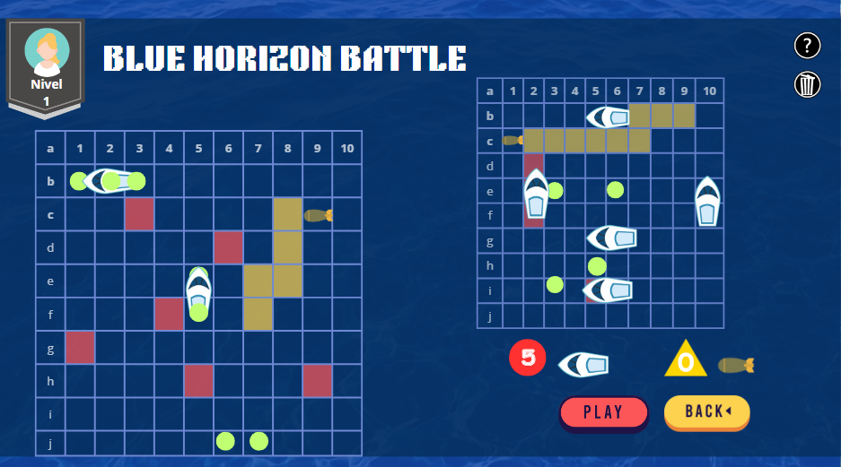

# **Proyecto: Blue horizon battle**

## **2. Tipos de Usuario**

1. **Jugador Casual**:
   - Objetivo: Disfrutar de un juego rápido y fácil.
   - Necesidades: Interfaz sencilla, reglas claras, y opción de jugar contra otro jugador o la IA.
   
2. **Jugador Competitivo**:
   - Objetivo: Mejorar habilidades enfrentándose a la IA.
   - Necesidades: IA desafiante que mejore su estrategia al encontrar barcos, funcionalidad de minas.
   
3. **Entusiasta de la Tecnología**:
   - Objetivo: Explorar la parte técnica del juego.
   - Necesidades: Acceso al código y documentación técnica, pruebas de nuevas funcionalidades.
   
4. **Estudiante de Ingeniería/Desarrollador**:
   - Objetivo: Aprender sobre diseño de software y programación de juegos.
   - Necesidades: Código limpio, comentarios, documentación técnica y arquitectura del sistema.

---

# Perfil de Usuario

**Nombre:** Carlos Herrera  
**Edad:** 35 años  
**Ocupación:** Analista financiero  

## Experiencia en Videojuegos
- **Nivel de experiencia:** Baja  
- **Frecuencia de juego:** Ocasional, en su tiempo libre para relajarse.  

## Dispositivos Favoritos
- Laptop personal.  
- Smartphone (uso ocasional).  

## Intereses en Videojuegos
Aunque no está familiarizado con videojuegos de estrategia avanzados, Carlos disfrutó juegos de mesa como *“Blue horizon battle”* en su juventud. Este tipo de juegos en formato de terminal le generan un sentido de nostalgia, permitiéndole revivir esas experiencias de una manera accesible.  

Además, Carlos busca mantener su mente activa y ve en estos juegos una forma divertida de ejercitar sus habilidades de planificación.  

# Perfil de Usuario: Sofía García

- **Nombre:** Sofía García  
- **Edad:** 28 años  
- **Ocupación:** Profesora de secundaria en Matemáticas  
- **Experiencia en videojuegos:** Básica, disfruta juegos de mesa y puzzles  
- **Dispositivos favoritos:** Laptop y tablet  

## Intereses y Preferencias
Sofía está interesada en encontrar **juegos sencillos y educativos** que pueda utilizar como actividades de aprendizaje para sus alumnos. Aunque no es una gamer, disfruta de juegos que:  
- Sean fáciles de entender.  
- Fomenten habilidades de lógica en sus estudiantes.  

## Hábitos de juego
- Juega ocasionalmente para relajarse después del trabajo.  
- Prefiere juegos que:  
  - No demanden mucho tiempo.  
  - Sean entretenidos y estimulantes.  

---

# Blue Horizon Battle

Este es un ejemplo del juego **Blue Horizon Battle**, un juego de lógica inspirado en la batalla naval.

## Descripción
En esta pantalla, los jugadores pueden:
- Colocar sus barcos en el tablero.
- Seleccionar los objetivos del oponente.
- Disfrutar de un diseño intuitivo y dinámico.

**Instrucciones:**
1. Coloca tus barcos en posiciones estratégicas.
2. Intenta hundir los barcos de tu oponente antes de que ellos hundan los tuyos.

---
## 4. **Historia de Usuario**

| **ID** | **Historia de Usuario**                                      | **Criterios de Aceptación**                                 | **Estimación** |
|--------|-------------------------------------------------------------|------------------------------------------------------------|----------------|
| 1      | Como jugador, quiero colocar mis barcos en un tablero       | Los barcos no deben traslaparse ni salirse del tablero     | 5 puntos       |
| 2      | Como jugador, quiero disparar a una coordenada del rival    | El disparo debe reflejarse en el tablero del rival         | 3 puntos       |
| 3      | Como jugador, quiero jugar contra la computadora            | La IA debe realizar disparos estratégicos                 | 8 puntos       |
| 4      | Como jugador, quiero usar minas acuáticas en el juego       | Las minas deben moverse y explotar adecuadamente          | 8 puntos       |
| 5      | Como jugador, quiero guardar y cargar mi partida            | El juego debe restaurarse desde un archivo                | 5 puntos       |

---

## **3. Análisis de Viabilidad**

# Evaluación de Viabilidad

## 1. Viabilidad Operativa

### Recursos Humanos:

- **Equipo necesario**:
  - 2-3 desarrolladores con experiencia en Python y desarrollo modular.
  - 1 Scrum Master (opcional) para coordinar el proyecto.

- **Habilidades requeridas**:
  - Conocimientos en programación orientada a objetos.
  - Familiaridad con la arquitectura modular y patrones de diseño.
  - Capacidad para implementar algoritmos básicos de IA.

### Recursos Técnicos:

- **Hardware y Software**:
  - Computadoras con IDEs adecuados (VS Code, PyCharm).
  - Bibliotecas de Python estándar (random, json) y opcionalmente `pygame` para gráficos.

### Procesos Operativos:

- Uso de metodologías ágiles como **Scrum** para dividir el trabajo en sprints de 2 semanas.
- Planificación adecuada para priorizar funcionalidades críticas.
- Comunicación frecuente entre los miembros del equipo.

**Conclusión Operativa**: **Viable**  
Con un equipo bien organizado y una metodología de trabajo clara, el proyecto es factible desde una perspectiva operativa.

---

## 2. Viabilidad Financiera

### Estimación de Costos:

- **Recursos Humanos**:
  - Costo promedio por desarrollador: **$20 USD/hora**.
  - Total de horas necesarias: **500-600 horas**.  
    (4 meses × 4 semanas/mes × 5 días/semana × 8 horas/día × 2-3 desarrolladores).
  - Costo total: **$20 × 600 horas × 2.5 desarrolladores = $30,000 USD**.

- **Recursos Tecnológicos**:
  - Software de desarrollo (usualmente gratuito o ya disponible).
  - Opcional: herramientas de pruebas automatizadas o licencias de bibliotecas gráficas.
  - Estimado: **$0-$500 USD**.

### Evaluación Financiera:

- Si se cuenta con un presupuesto cercano a **$30,000 USD**, el proyecto es financieramente viable.
- En equipos pequeños o estudiantiles, donde los costos humanos se reducen significativamente, el presupuesto puede adaptarse más fácilmente.

---

## 3. Viabilidad de Fechas

### Plazo Disponible: 
- **4 meses** (aproximadamente 16 semanas).

### Planificación del Cronograma (6 sprints de 2 semanas cada uno):

- **Sprint 1**: Diseño del sistema, desarrollo del tablero y colocación de barcos.
- **Sprint 2**: Implementación de turnos y lógica básica de disparos.
- **Sprint 3**: Desarrollo de la IA (algoritmos para disparos estratégicos).
- **Sprint 4**: Funcionalidad de minas acuáticas.
- **Sprint 5**: Guardado y carga de partidas.
- **Sprint 6**: Pruebas finales, ajustes y documentación.

### Riesgos de Fechas:

- Retrasos por complejidad en la IA o bugs.
- Tiempo insuficiente para pruebas completas si no se gestiona bien el cronograma.

### Evaluación de Fechas: **Viable, pero ajustado**  
Si el equipo sigue la metodología Scrum y prioriza las funcionalidades críticas, el plazo es suficiente. Las funcionalidades opcionales (e.g., gráficos avanzados) deben dejarse para fases posteriores.

---

## Conclusión General

- **Viabilidad Operativa**: **Alta**. Los recursos técnicos y humanos son accesibles.
- **Viabilidad Financiera**: **Moderada**. Requiere un presupuesto significativo para un equipo profesional, pero es viable en un entorno académico o con voluntarios.
- **Viabilidad de Fechas**: **Alta, pero ajustada**. Con buena gestión del tiempo y priorización, el proyecto puede completarse en 4 meses.

---

# Análisis de Riesgos

## 1. Riesgos Humanos

### Falta de experiencia en el equipo:
- **Descripción**: Miembros del equipo con poca experiencia en programación, IA o arquitectura de software.
- **Impacto**: Retrasos en la implementación y calidad del código.
- **Mitigación**:
  - Capacitación inicial en áreas críticas.
  - Uso de bibliotecas y herramientas con documentación amplia.
  - Asignación de tareas según la experiencia de cada miembro.

### Desmotivación del equipo:
- **Descripción**: Problemas de motivación debido a carga de trabajo excesiva o falta de claridad en los objetivos.
- **Impacto**: Baja productividad y posibles abandonos.
- **Mitigación**:
  - Definir objetivos claros y alcanzables en cada sprint.
  - Reuniones de retroalimentación para identificar problemas temprano.
  - Fomentar un ambiente de trabajo positivo.

### Pérdida de miembros clave:
- **Descripción**: Salida inesperada de un desarrollador.
- **Impacto**: Reasignación de tareas y posible retraso en el cronograma.
- **Mitigación**:
  - Documentar el progreso y el código para facilitar la transferencia de conocimientos.
  - Crear redundancia en las habilidades del equipo.

---

## 2. Riesgos Técnicos

### Complejidad en la implementación de la IA:
- **Descripción**: Dificultad para desarrollar una IA que cumpla con los requisitos (estrategia tras encontrar un barco).
- **Impacto**: IA poco funcional que afecte la jugabilidad.
- **Mitigación**:
  - Desarrollar primero una IA básica y luego iterar sobre ella.
  - Utilizar heurísticas simples y bien documentadas.
  - Revisar implementaciones existentes de IA para juegos similares.

### Problemas con el guardado/carga de partidas:
- **Descripción**: Error en la serialización/deserialización de datos complejos (e.g., posición de la mina).
- **Impacto**: Pérdida de datos o estados de juego corruptos.
- **Mitigación**:
  - Crear pruebas unitarias específicas para el módulo de guardado/carga.
  - Utilizar formatos de datos estándar como JSON o YAML.
  - Probar casos extremos de datos para asegurar robustez.

### Compatibilidad técnica:
- **Descripción**: Problemas al ejecutar el juego en diferentes sistemas operativos o entornos.
- **Impacto**: Experiencia inconsistente para los usuarios.
- **Mitigación**:
  - Probar el juego en múltiples plataformas durante el desarrollo.
  - Documentar dependencias y requerimientos del sistema.
  - Considerar empaquetar el juego con herramientas como PyInstaller.

---

## 3. Riesgos de Negocio

### Desalineación con los objetivos del proyecto:
- **Descripción**: El producto final no cumple con las expectativas del cliente o los usuarios (jugabilidad, IA insuficiente, etc.).
- **Impacto**: Insatisfacción del cliente y pérdida de valor del proyecto.
- **Mitigación**:
  - Reuniones regulares con los stakeholders para validar el progreso.
  - Realizar demostraciones incrementales al final de cada sprint.
  - Priorizar funcionalidades clave en el backlog.

### Falta de tiempo para pruebas y ajustes:
- **Descripción**: Tiempo insuficiente para identificar y corregir errores antes de la entrega.
- **Impacto**: Producto con bugs o sin pulir.
- **Mitigación**:
  - Reservar al menos 3 semanas para pruebas y correcciones al final del cronograma.
  - Implementar pruebas automatizadas durante el desarrollo.
  - Identificar las áreas más críticas del juego para pruebas intensivas.

### Incertidumbre en los costos:
- **Descripción**: Gastos inesperados o subestimación del esfuerzo requerido.
- **Impacto**: Exceder el presupuesto del proyecto.
- **Mitigación**:
  - Realizar una estimación realista de costos y recursos antes de iniciar.
  - Monitorear regularmente el progreso frente al presupuesto.
  - Mantener una reserva de tiempo y recursos para imprevistos.

---

## Resumen de Riesgos y Priorización

| **Categoría** | **Riesgo**                               | **Probabilidad** | **Impacto** | **Nivel**  | **Acción**                     |
|---------------|-----------------------------------------|------------------|-------------|------------|--------------------------------|
| Humano        | Falta de experiencia en IA              | Alta             | Alta        | Crítico    | Capacitación inicial           |
| Humano        | Desmotivación del equipo                | Media            | Media       | Moderado   | Feedback y objetivos claros    |
| Técnico       | Problemas con la IA                     | Media            | Alta        | Crítico    | IA básica iterativa            |
| Técnico       | Fallos en guardado/carga de partidas    | Media            | Alta        | Crítico    | Pruebas unitarias extensivas   |
| Técnico       | Compatibilidad técnica                  | Baja             | Media       | Moderado   | Pruebas multiplataforma        |
| Negocio       | Desalineación con objetivos             | Media            | Alta        | Crítico    | Validación con stakeholders    |
| Negocio       | Falta de tiempo para pruebas            | Alta             | Alta        | Crítico    | Reservar tiempo suficiente     |
| Negocio       | Incertidumbre en costos                 | Media            | Media       | Moderado   | Monitoreo y control            |

---

## Conclusión

Los riesgos más críticos están relacionados con la **IA**, el **guardado/carga de partidas**, y la **falta de tiempo para pruebas**. La mitigación temprana y la priorización de funcionalidades pueden ayudar a reducir estos riesgos significativamente.

---

# **Justificación del Proyecto**

El proyecto **Blue Horizon Battle** se justifica como una iniciativa educativa y tecnológica que combina el diseño de un sistema interactivo y divertido con la aplicación práctica de conceptos de **arquitectura de software**, **programación modular** y **metodologías ágiles**. Este proyecto tiene un impacto significativo tanto en el desarrollo de habilidades técnicas como en la creación de un producto funcional y de valor para los usuarios.

## **Razones para el Desarrollo del Proyecto**

### **Aplicación de conceptos avanzados de ingeniería de software**:
- Permite a los participantes implementar patrones de diseño, principios SOLID y procesos iterativos que son esenciales en proyectos de software de la vida real.
- Desarrolla habilidades en el uso de tecnologías modernas como la programación orientada a objetos, algoritmos básicos de inteligencia artificial y manejo de estructuras de datos.

### **Resolución de un problema clásico con un enfoque innovador**:
- El juego **Blue Horizon Battle** es un desafío estratégico conocido que, con modificaciones como minas acuáticas e IA avanzada, se transforma en una experiencia más dinámica y entretenida.
- Ofrece una plataforma para explorar el desarrollo de IA y lógica avanzada de juegos.

### **Enfoque educativo y didáctico**:
- Es un ejemplo práctico para enseñar conceptos como:
  - Diseño modular y arquitectura escalable.
  - Ciclo de vida del desarrollo de software.
  - Gestión de proyectos con metodologías ágiles como **Scrum**.
- Ideal para estudiantes y equipos que buscan aprender mediante proyectos reales.

### **Escalabilidad y adaptabilidad del proyecto**:
- El sistema está diseñado para ser ampliado con funcionalidades futuras como gráficos avanzados, modos multijugador o integración en línea.
- Puede servir como base para el desarrollo de otros juegos similares.

## **Valor que Ofrece el Proyecto**

### **Valor Educativo**:
- **Para estudiantes y desarrolladores**:
  - Una oportunidad para aprender a resolver problemas complejos con herramientas prácticas.
  - Experiencia en proyectos iterativos con entregas funcionales al final de cada sprint.
- **Para instituciones educativas**:
  - Un caso de estudio que ilustra principios de ingeniería de software y diseño de sistemas.

### **Valor de Entretenimiento**:
- Ofrece a los jugadores una experiencia estratégica con reglas clásicas mejoradas por innovaciones como minas acuáticas y una IA desafiante.
- Ideal para juegos casuales entre amigos o partidas individuales contra una computadora.

### **Valor Tecnológico**:
- Una demostración práctica de cómo implementar una IA estratégica básica en juegos.
- Un ejemplo claro de cómo manejar la persistencia de datos mediante guardado y carga de partidas.

### **Modelo de Monetización**
El proyecto **Blue Horizon Battle** puede generar ingresos sostenibles mediante las siguientes estrategias:

1. **Venta directa**:  
   - Licencias del juego dirigidas a plataformas educativas o comerciales.

2. **Versión gratuita con opciones premium**:  
   - Ofrecemos expansiones, modos avanzados y elementos personalizados que los jugadores pueden adquirir opcionalmente.

3. **Publicidad in-game**:  
   - Espacios publicitarios no invasivos que integren anuncios relevantes para los usuarios.

4. **Licenciamiento B2B**:  
   - Integración del juego en plataformas de terceros, como sistemas educativos o de entretenimiento corporativo.

### **Valor de Escalabilidad y Mantenimiento**:
- El diseño modular permite agregar fácilmente nuevas características, como gráficos avanzados, modos de juego adicionales, o un sistema multijugador en línea.
- Puede servir como base para proyectos más grandes o complejos en el ámbito del desarrollo de software y videojuegos.

## **Conclusión**
El proyecto **Blue Horizon Battle** no solo entrega un producto final funcional y divertido, sino que también actúa como una herramienta de aprendizaje y desarrollo. Ofrece un valor claro a estudiantes, desarrolladores y jugadores, mientras demuestra cómo aplicar conceptos avanzados de ingeniería de software en un entorno práctico y accesible.

---

## **1. Tareas a Realizar**

### **Tareas Generales**:
- **Diseño del Sistema**:
  - Definir la estructura de la arquitectura del juego.
  - Desarrollar el diagrama de clases y componentes.
- **Desarrollo del Tablero**:
  - Crear la representación de la matriz.
  - Implementar la lógica para la colocación de barcos.
  - Validar la colocación de barcos (sin traslapos ni fuera de los límites).
- **Lógica de Turnos y Disparos**:
  - Implementar la alternancia de turnos entre los jugadores.
  - Crear la funcionalidad para disparar a una coordenada del tablero rival.
  - Notificar aciertos y fallos.
- **Desarrollo de IA**:
  - Implementar una IA básica para disparos aleatorios.
  - Mejorar la IA para que se enfoque en hundir barcos una vez encontrados.
- **Implementación de Minas Acuáticas**:
  - Permitir a los jugadores colocar minas.
  - Programar el movimiento aleatorio de las minas.
  - Manejar la explosión de minas al encontrarse con un barco.
- **Funcionalidad de Guardado y Carga**:
  - Implementar el guardado de estado del juego en archivos.
  - Crear la funcionalidad para cargar un juego guardado.
- **Interfaz de Usuario**:
  - Diseñar una interfaz gráfica básica o en consola para representar el tablero.
  - Implementar mensajes claros para los jugadores.

### **Tareas de Pruebas**:
- **Pruebas Unitarias**:
  - Validar cada módulo independiente del sistema (tablero, IA, guardado, etc.).
- **Pruebas de Integración**:
  - Verificar la interacción entre módulos (IA + tablero, guardado + carga).
- **Pruebas de Aceptación**:
  - Validar el cumplimiento de los requisitos con el cliente.

---

## **6. Explicación de lo Hecho en los Sprints**

### **Sprint 1**: *Diseño del Sistema y Tablero*
- Definición de la arquitectura del sistema.
- Creación de la matriz de tablero y la lógica básica de colocación de barcos.

### **Sprint 2**: *Turnos y Lógica de Disparos*
- Implementación de la alternancia de turnos entre los jugadores.
- Lógica para disparar y validar aciertos o fallos.

### **Sprint 3**: *Desarrollo de IA*
- Programación de la IA básica para disparos aleatorios.
- Mejora de la IA para enfocarse en barcos encontrados.

### **Sprint 4**: *Minas Acuáticas*
- Implementación de la funcionalidad de minas acuáticas, incluyendo su colocación y movimiento aleatorio.

### **Sprint 5**: *Guardado y Carga de Partidas*
- Desarrollo del sistema de guardado de estado del juego y su posterior carga.

### **Sprint 6**: *Pruebas, Ajustes y Documentación Final*
- Realización de pruebas unitarias e integración.
- Documentación de la arquitectura y el código para facilitar mantenimiento.

